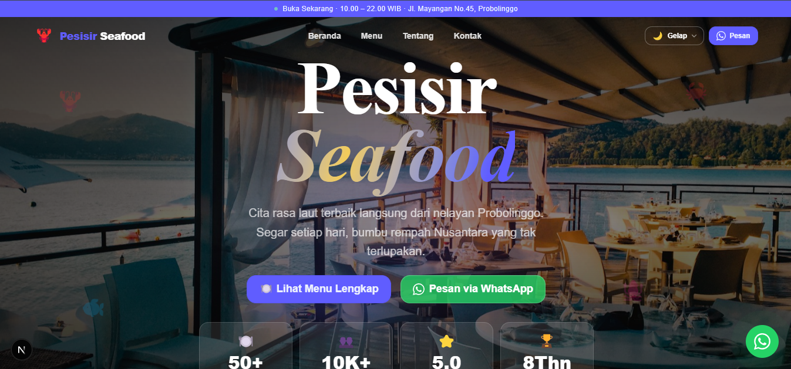
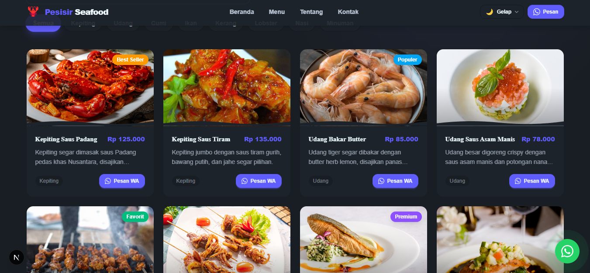
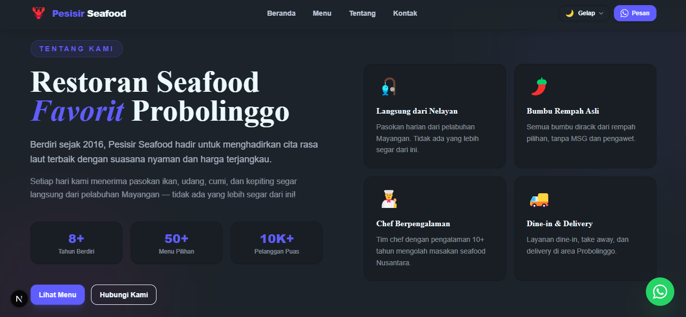
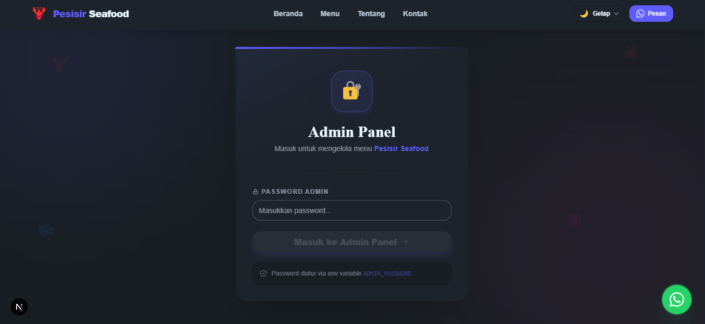

# 🦞 Pesisir Seafood — Seafood Restaurant Website

A modern seafood restaurant website built with **Next.js 16**, **Tailwind CSS v4**, and **DaisyUI v5**. Comes with a full admin panel to manage the menu (CRUD) including photo upload support.

---

## Screenshots

### Hero & Navbar

> Homepage with responsive navigation, theme switcher, and a hero section featuring animated floating seafood emojis.

---

### Menu

> Menu list with category filters and real-time search. Each item displays a photo, name, description, price, and badges such as "Best Seller" or "Premium".

---

### About Us

> Lower section of the page containing the About Us section, customer testimonials, contact information, and footer.

---

### Admin Panel

> Admin page with password-based login, menu management table, and an add/edit form complete with photo upload.

---

## Features

- **6 Theme Options** — Samudra 🌊, Sunset 🌅, Karang 🪸, Mangrove 🌿, Mewah ✨, Segar 🌸
- **Interactive Menu** — Category filter + real-time search
- **Admin Panel** — Full menu CRUD with image upload
- **Photo Upload** — Supports JPG, PNG, WEBP up to 5MB
- **Responsive Design** — Mobile-first, looks great on all devices
- **Smooth Scrolling** — Seamless navigation between sections
- **Animations** — Hero floating emojis, hover cards, theme transitions

---

## Getting Started

```bash
# 1. Install dependencies
npm install

# 2. Copy and configure environment variables
cp .env.local.example .env.local

# 3. Run the development server
npm run dev

# 4. Open in browser
http://localhost:3000
```

---

## Environment Variables

Create a `.env.local` file in the project root:

```env
# Change this password before deploying!
ADMIN_PASSWORD=seafood123
```

> **Warning:** Make sure to change `ADMIN_PASSWORD` before deploying to production.

---

## Available Themes

| Key     | Label        | DaisyUI Theme |
|---------|--------------|---------------|
| ocean   | 🌊 Samudra   | dark          |
| sunset  | 🌅 Sunset    | cupcake       |
| coral   | 🪸 Karang    | synthwave     |
| forest  | 🌿 Mangrove  | forest        |
| luxury  | ✨ Mewah     | black         |
| fresh   | 🌸 Segar     | lofi          |

---

## Tech Stack

| Technology   | Version  | Description                       |
|--------------|----------|-----------------------------------|
| Next.js      | ^16.2.0  | React framework with App Router   |
| React        | ^19.0.0  | UI library                        |
| Tailwind CSS | v4       | Utility-first CSS framework       |
| DaisyUI      | v5       | Tailwind-based UI components      |
| TypeScript   | ^5       | Type-safe JavaScript              |

---

## Project Structure

```
pesisir-seafood/
├── app/
│   ├── admin/
│   │   └── page.tsx          # Admin panel page (login + CRUD)
│   ├── api/
│   │   ├── menu/
│   │   │   ├── route.ts      # GET all menu items, POST new item
│   │   │   └── [id]/
│   │   │       └── route.ts  # PUT update item, DELETE remove item
│   │   └── upload/
│   │       └── route.ts      # POST upload menu image
│   ├── globals.css            # Tailwind + DaisyUI imports
│   ├── layout.tsx             # Root layout with ThemeProvider
│   └── page.tsx               # Main page
├── components/
│   ├── ThemeContext.tsx        # Theme management context
│   ├── Navbar.tsx             # Navigation + theme switcher
│   ├── Hero.tsx               # Hero section
│   ├── MenuSection.tsx        # Menu list + filter + search
│   ├── About.tsx              # About us + testimonials
│   ├── Contact.tsx            # Contact + restaurant info
│   └── Footer.tsx             # Page footer
├── data/
│   └── menu.ts                # Menu data & theme config
├── lib/
│   └── store.ts               # In-memory store for menu data
├── screenshots/               # Website screenshots
├── .env.local                 # Environment variables (not committed)
└── vercel.json                # Vercel deployment config
```

---

## Admin Panel

Access the admin panel at `/admin`. Log in using the password configured in `.env.local`.

### Menu CRUD

| Action | Endpoint         | Method | Description                  |
|--------|------------------|--------|------------------------------|
| Read   | `/api/menu`      | GET    | Fetch all menu items         |
| Create | `/api/menu`      | POST   | Add a new menu item          |
| Update | `/api/menu/[id]` | PUT    | Edit an existing menu item   |
| Delete | `/api/menu/[id]` | DELETE | Remove a menu item           |
| Upload | `/api/upload`    | POST   | Upload a photo for menu item |

> All endpoints (except GET) require a valid `x-admin-password` header.

### Photo Upload

The `POST /api/upload` endpoint handles menu item photo uploads.

**Upload specs:**
- **Supported formats:** JPG, JPEG, PNG, WEBP
- **Maximum file size:** 5MB per file
- **Storage:** Saved to `public/uploads/` with a unique timestamp-based filename
- **Response:** Returns a public URL in the format `/uploads/filename.ext`

**How it works in the admin panel:**
```
Select file -> Preview appears automatically -> Submit form
-> Photo is saved & URL is automatically filled in the image field
```

### Available Categories

`Kepiting` · `Udang` · `Cumi` · `Ikan` · `Kerang` · `Lobster` · `Nasi` · `Minuman`

### Available Badges

`Best Seller` · `Populer` · `Favorit` · `Premium` · `Signature`

---

## Deploy to Vercel

```bash
# Install Vercel CLI
npm i -g vercel

# Deploy
vercel

# Set environment variable in Vercel Dashboard:
# ADMIN_PASSWORD = <your-password>
```

---

## Notes

- Menu data is stored **in-memory** and will reset on server restart. For production, consider using a persistent database such as PostgreSQL or MongoDB.
- Uploaded photos are stored in `public/uploads/`. Make sure this folder is excluded from Git commits (already handled in `.gitignore`).

---

Built by **[Rayn](https://rayn.web.id)** — rayn.web.id
